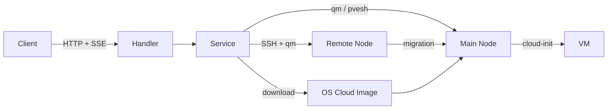

> [!NOTE]
> This README was generated by [SKILL](https://github.com/pardnchiu/skill-readme-generate), get the ZH version from [here](./doc/README.zh.md).

# go-pve-qemu

> Production-grade Proxmox VE VM automation REST API built in Go — full lifecycle provisioning via SSE, concurrent IP & CPU architecture auto-allocation, and transparent multi-node cluster routing.

[](https://pkg.go.dev/github.com/pardnchiu/go-pve-qemu)
[](https://goreportcard.com/report/github.com/pardnchiu/go-pve-qemu)
[](LICENSE)
[](https://github.com/pardnchiu/go-pve-qemu/releases)

## Table of Contents

- [Features](#features)
- [Architecture](#architecture)
- [File Structure](#file-structure)
- [License](#license)
- [Author](#author)
- [Stars](#stars)

## Features

> `git clone https://github.com/pardnchiu/go-pve-qemu.git` · [Documentation](./doc/doc.md)

### SSE-Driven Full-Lifecycle Automated Installation

The entire VM provisioning pipeline — OS image download, VM creation, disk import, cloud-init configuration, SSH key injection, and OS initialization script execution — runs as a single automated flow. Real-time progress is streamed to the client via Server-Sent Events (SSE), eliminating the need for polling. Each pipeline step reports its elapsed time, making the full lifecycle observable end-to-end without any additional tooling.

### Concurrent IP & CPU Architecture Auto-Allocation

VMID and IP assignment uses concurrent goroutines with semaphore control to scan available addresses from both ends simultaneously, finding the first available slot within a 10-second timeout. CPU architecture compatibility (x86-64-v1/v2/v3/v4) is auto-detected across all cluster nodes by inspecting CPU flags, then cached locally — ensuring every VM always boots with the widest-compatible CPU type for the cluster.

### Transparent Multi-Node Cluster Routing

API requests targeting VMs on any node are routed transparently — `qm`/`pvesh` commands run locally for the main node, SSH-dispatched commands execute on remote nodes — without exposing cluster topology to the caller. Live VM migration between nodes is supported via a single API endpoint with SSE progress streaming, making multi-node operations indistinguishable from single-node ones.

## Architecture



## File Structure

```
go-pve-qemu/
├── cmd/
│   └── api/
│       └── main.go          # Entry point, .env loading, Gin setup
├── internal/
│   ├── config/              # Routes & CORS middleware (private IP only)
│   ├── handler/             # HTTP request handlers & input validation
│   ├── model/               # Config, Response, SSE, VM, Node, Status types
│   ├── service/             # Business logic (install, start, stop, migrate…)
│   └── util/                # IP check, VM/Node map helpers
├── sh/                      # OS init scripts (debian/ubuntu/rockylinux)
├── go.mod
└── .env.example             # Configuration template
```

## License

This project is licensed under the [AGPL-3.0 LICENSE](LICENSE).

## Author


<h4 style="padding-top: 0">邱敬幃 Pardn Chiu</h4>

<a href="mailto:dev@pardn.io" target="_blank">

</a> <a href="https://linkedin.com/in/pardnchiu" target="_blank">

</a>

## Stars

[](https://www.star-history.com/#pardnchiu/go-pve-qemu&Date)

***

©️ 2025 [邱敬幃 Pardn Chiu](https://linkedin.com/in/pardnchiu)
