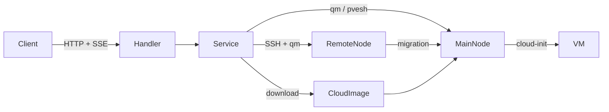

> [!NOTE]
> This README was generated by [SKILL](https://github.com/agenvoy/skill-readme-generate), get the ZH version from [here](./doc/README.zh.md).

***

<strong>PRODUCTION-GRADE PROXMOX VE VM AUTOMATION REST API</strong>

***

> A Go-based Proxmox VE REST API with SSE-driven full-lifecycle VM provisioning, concurrent IP and CPU architecture auto-allocation, and transparent multi-node cluster routing

## Table of Contents

- [Features](#features)
- [Architecture](#architecture)
- [License](#license)
- [Author](#author)

## Features

> `git clone https://github.com/pardnchiu/go-pve-qemu.git` · [Documentation](./doc/doc.md)

- **SSE-Driven Fully Automated Provisioning** — From OS image download, VM creation, disk import to SSH initialization, the entire pipeline completes in a single API call with real-time progress streamed via Server-Sent Events — no polling required.
- **Concurrent IP and CPU Architecture Allocation** — VMID and IP assignment uses concurrent goroutines scanning from both ends simultaneously; CPU architecture compatibility (x86-64-v1~v4) is auto-detected across all cluster nodes and cached, ensuring every VM boots with the widest-compatible CPU type.
- **Transparent Multi-Node Cluster Routing** — Local qm/pvesh execution on the main node, automatic SSH dispatch to remote nodes — callers never see cluster topology; a single API endpoint handles live migration with local disk transfer between nodes.
- **Cloud-Init and SSH Key Management** — Automatically injects user SSH public keys and admin keys, configures cloud-init networking and passwords, disables boot-time package upgrades, and executes OS-specific initialization scripts (Debian/Ubuntu/RockyLinux).
- **Resource Cap Enforcement and Balloon Support** — Per-VM CPU, RAM, and disk caps via environment variables with automatic clamping; balloon device and NUMA topology support, auto-enabled when RAM ≥ 64GB.

## Architecture

> [Full Architecture](./doc/architecture.md)

```mermaid
graph LR
    Client -->|HTTP + SSE| Handler
    Handler --> Service
    Service -->|qm / pvesh| MainNode
    Service -->|SSH + qm| RemoteNode
    MainNode -->|cloud-init| VM
    RemoteNode -->|migration| MainNode
    Service -->|download| CloudImage
    CloudImage --> MainNode
```

## License

This project is licensed under the [AGPL-3.0 LICENSE](LICENSE).

## Author

<h4 style="padding-top: 0">邱敬幃 Pardn Chiu</h4>

<a href="mailto:hi@pardn.io">hi@pardn.io</a> 
<a href="https://www.linkedin.com/in/pardnchiu">https://www.linkedin.com/in/pardnchiu</a>

***

©️ 2025 [邱敬幃 Pardn Chiu](https://www.linkedin.com/in/pardnchiu)