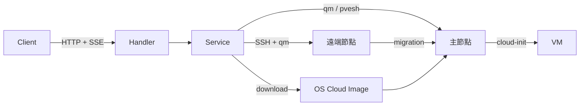

> [!NOTE]
> 此 README 由 [SKILL](https://github.com/pardnchiu/skill-readme-generate) 生成，英文版請參閱 [這裡](../README.md)。

# go-pve-qemu

> 以 Go 構建的生產級 Proxmox VE 虛擬機自動化 REST API — 透過 SSE 實現完整生命週期佈建、並發 IP 與 CPU 架構自動分配，以及透明多節點叢集路由。

[](https://pkg.go.dev/github.com/pardnchiu/go-pve-qemu)
[](https://goreportcard.com/report/github.com/pardnchiu/go-pve-qemu)
[](LICENSE)
[](https://github.com/pardnchiu/go-pve-qemu/releases)

## 目錄

- [功能特點](#功能特點)
- [架構](#架構)
- [檔案結構](#檔案結構)
- [授權](#授權)
- [Author](#author)
- [Stars](#stars)

## 功能特點

> `git clone https://github.com/pardnchiu/go-pve-qemu.git` · [完整文件](./doc.zh.md)

### SSE 驅動的完整生命週期自動化安裝

整個 VM 佈建流程 — OS 映像下載、VM 建立、磁碟匯入、cloud-init 設定、SSH 金鑰注入，以及 OS 初始化腳本執行 — 以單一自動化流程完成。即時進度透過 Server-Sent Events (SSE) 串流傳送至用戶端，完全消除輪詢需求。每個流程步驟均回報耗用時間，無需額外工具即可端對端觀察完整生命週期。

### 並發 IP 與 CPU 架構自動分配

VMID 與 IP 分配使用並發 Goroutine 配合 Semaphore 控制，從兩端同時掃描可用位址，在 10 秒逾時限制內找出第一個可用槽位。CPU 架構相容性（x86-64-v1/v2/v3/v4）透過檢查所有叢集節點的 CPU 旗標自動偵測，並於本機快取 — 確保每台 VM 始終以叢集中最廣相容的 CPU 類型啟動。

### 透明多節點叢集路由

針對叢集中任意節點上的 VM 之 API 請求均透明路由 — 主節點使用本機 `qm`/`pvesh` 指令，遠端節點使用 SSH 派送指令 — 呼叫端無需感知叢集拓撲。節點間即時 VM 遷移透過單一 API Endpoint 搭配 SSE 進度串流支援，使多節點操作與單節點操作無縫一致。

## 架構



## 檔案結構

```
go-pve-qemu/
├── cmd/
│   └── api/
│       └── main.go          # 程式進入點、.env 載入、Gin 設定
├── internal/
│   ├── config/              # 路由與 CORS Middleware（僅允許私有 IP）
│   ├── handler/             # HTTP 請求處理器與輸入驗證
│   ├── model/               # Config、Response、SSE、VM、Node、Status 型別
│   ├── service/             # 業務邏輯（install、start、stop、migrate…）
│   └── util/                # IP 檢查、VM/Node Map 輔助函式
├── sh/                      # OS 初始化腳本（debian/ubuntu/rockylinux）
├── go.mod
└── .env.example             # 環境設定範本
```

## 授權

本專案採用 [AGPL-3.0 LICENSE](LICENSE)。

## Author


<h4 style="padding-top: 0">邱敬幃 Pardn Chiu</h4>

<a href="mailto:dev@pardn.io" target="_blank">

</a> <a href="https://linkedin.com/in/pardnchiu" target="_blank">

</a>

## Stars

[](https://www.star-history.com/#pardnchiu/go-pve-qemu&Date)

***

©️ 2025 [邱敬幃 Pardn Chiu](https://linkedin.com/in/pardnchiu)
