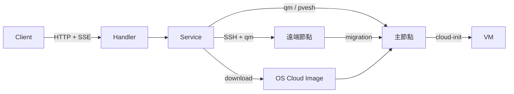

> [!NOTE]
> 此 README 由 [SKILL](https://github.com/agenvoy/skill-readme-generate) 生成，英文版請參閱 [這裡](../README.md)。

***

<strong>PRODUCTION-GRADE PROXMOX VE VM AUTOMATION REST API</strong>

***

> 以 Go 構建的 Proxmox VE REST API，具備 SSE 驅動的完整生命週期 VM 佈建、並發 IP 與 CPU 架構自動分配，以及透明多節點叢集路由

## 目錄

- [功能特點](#功能特點)
- [架構](#架構)
- [授權](#授權)
- [Author](#author)

## 功能特點

> `git clone https://github.com/pardnchiu/go-pve-qemu.git` · [完整文件](./doc.zh.md)

- **SSE 驅動全自動化佈建** — 從 OS 映像下載、VM 建立、磁碟匯入到 SSH 初始化，整條管線以單一 API 呼叫完成，即時進度透過 Server-Sent Events 串流，無需輪詢。
- **並發 IP 與 CPU 架構分配** — VMID 與 IP 使用並發 Goroutine 從兩端同時掃描可用位址，CPU 架構相容性（x86-64-v1~v4）自動偵測所有叢集節點並快取，確保 VM 始終以最廣相容類型啟動。
- **透明多節點叢集路由** — 主節點本機執行 qm/pvesh，遠端節點自動透過 SSH 派送指令，呼叫端無需感知拓撲；單一 API 即可完成含本機磁碟的節點間即時遷移。
- **Cloud-Init 與 SSH 金鑰管理** — 自動注入使用者 SSH 公鑰與管理員金鑰、設定 cloud-init 網路與密碼、禁用開機套件升級，並執行 OS 專屬初始化腳本（Debian/Ubuntu/RockyLinux）。
- **資源上限強制與 Balloon 支援** — 透過環境變數設定每台 VM 的 CPU、RAM、磁碟上限，自動夾緊超標請求；支援 Balloon 裝置與 NUMA 拓撲，RAM ≥ 64GB 時自動啟用。

## 架構

> [完整架構](./architecture.zh.md)

```mermaid
graph LR
    Client -->|HTTP + SSE| Handler
    Handler --> Service
    Service -->|qm / pvesh| MainNode[主節點]
    Service -->|SSH + qm| RemoteNode[遠端節點]
    MainNode -->|cloud-init| VM
    RemoteNode -->|migration| MainNode
    Service -->|download| CloudImage[OS Cloud Image]
    CloudImage --> MainNode
```

## 授權

本專案採用 [AGPL-3.0 LICENSE](LICENSE)。

## Author

<h4 style="padding-top: 0">邱敬幃 Pardn Chiu</h4>

<a href="mailto:hi@pardn.io">hi@pardn.io</a> 
<a href="https://www.linkedin.com/in/pardnchiu">https://www.linkedin.com/in/pardnchiu</a>

***

©️ 2025 [邱敬幃 Pardn Chiu](https://www.linkedin.com/in/pardnchiu)