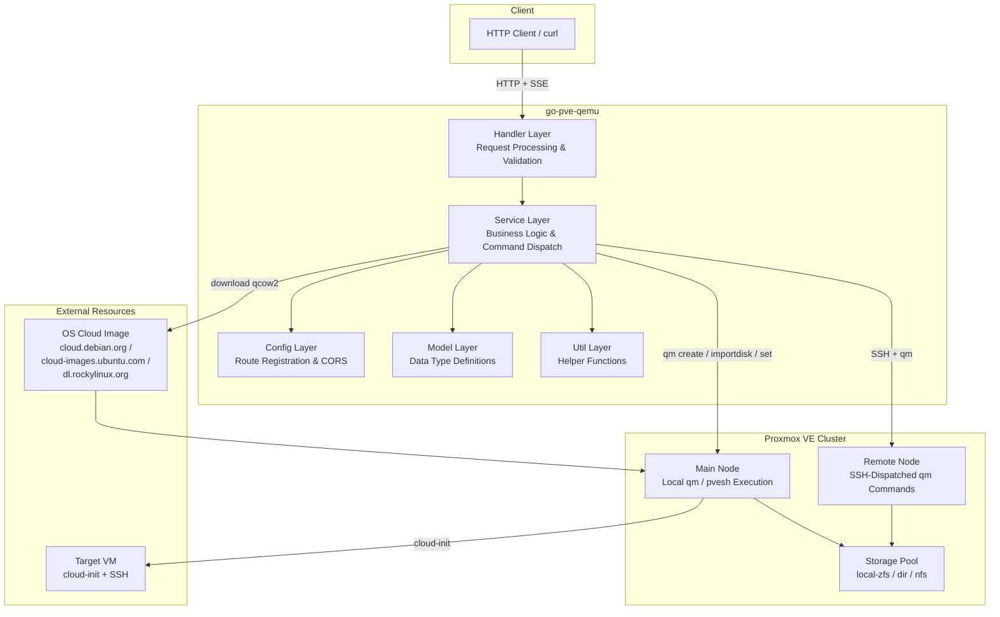
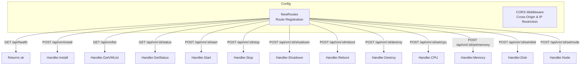
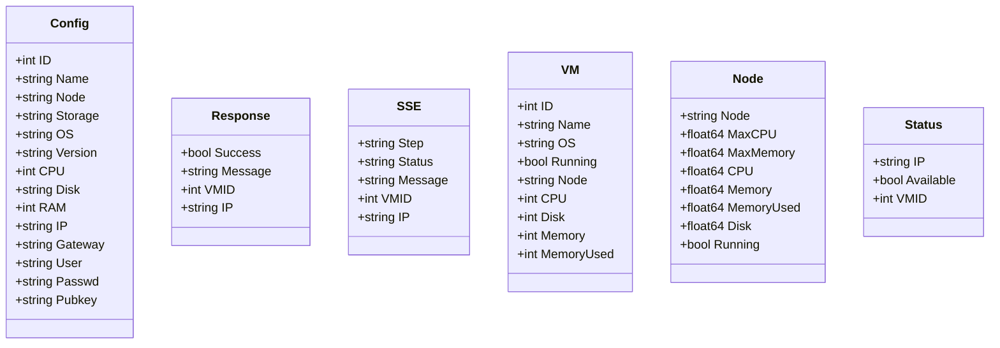
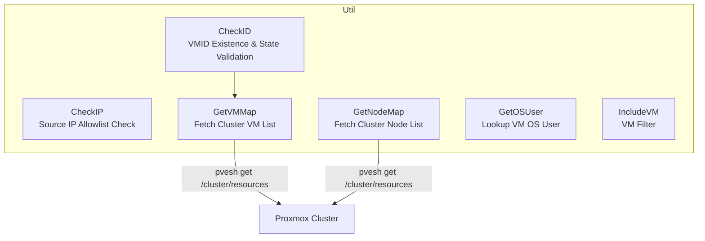
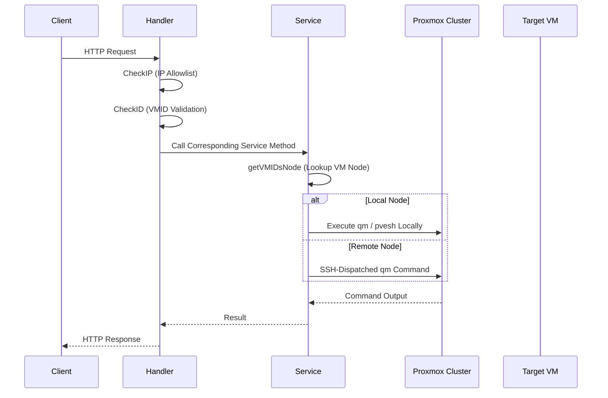
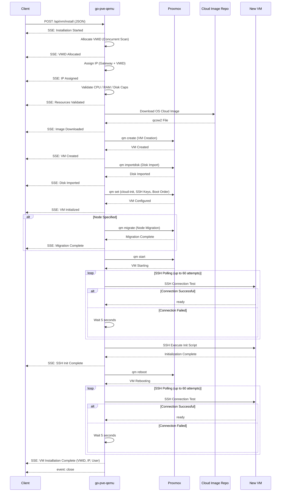
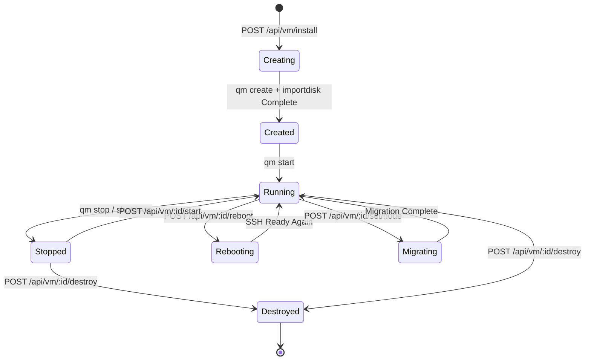

# go-pve-qemu — Architecture

> Back to [README](../README.md)

## Table of Contents

- [Overview](#overview)
- [Module: Handler](#module-handler)
- [Module: Service](#module-service)
- [Module: Config](#module-config)
- [Module: Model](#module-model)
- [Module: Util](#module-util)
- [Data Flow](#data-flow)
- [VM Lifecycle State Machine](#vm-lifecycle-state-machine)

---

## Overview

## Module: Handler

The Handler layer receives HTTP requests, validates inputs, and produces responses. All externally exposed API endpoints are defined here.

```mermaid
graph TB
    subgraph Handler
        Install[Install<br/>POST /api/vm/install]
        Start[Start<br/>POST /api/vm/:id/start]
        Stop[Stop<br/>POST /api/vm/:id/stop]
        Shutdown[Shutdown<br/>POST /api/vm/:id/shutdown]
        Reboot[Reboot<br/>POST /api/vm/:id/reboot]
        Destroy[Destroy<br/>POST /api/vm/:id/destroy]
        CPU[Set CPU<br/>POST /api/vm/:id/set/cpu]
        Memory[Set Memory<br/>POST /api/vm/:id/set/memory]
        Disk[Set Disk<br/>POST /api/vm/:id/set/disk]
        Node[Set Node<br/>POST /api/vm/:id/set/node]
        GetStatus[Get Status<br/>GET /api/vm/:id/status]
        GetVMList[Get VM List<br/>GET /api/vm/list]
    end

    Install -->|SSE Stream| Service
    Start -->|SSE Stream| Service
    Reboot -->|SSE Stream| Service
    Node -->|SSE Stream| Service
    Stop --> Service
    Shutdown --> Service
    Destroy --> Service
    CPU --> Service
    Memory --> Service
    Disk --> Service
    GetStatus --> Service
    GetVMList --> Service
```

**Responsibilities:**
- Parse HTTP requests and path parameters
- Validate source IP against the allowlist via `util.CheckIP()`
- Verify VMID existence and state via `util.CheckID()`
- Forward requests to the corresponding Service layer method
- Set SSE headers and stream events for SSE endpoints

## Module: Service

The Service layer contains all business logic and is the core of the system. It encapsulates Proxmox CLI command execution, SSH dispatch, OS image management, and IP allocation logic.

```mermaid
graph TB
    subgraph Service
        InstallSvc[Install<br/>Full VM Provisioning Pipeline]
        StartSvc[Start<br/>Boot + SSH Wait]
        StopSvc[Stop / Shutdown]
        RebootSvc[Reboot<br/>Restart + SSH Wait]
        DestroySvc[Destroy<br/>Stop + Purge]
        CPUSvc[Set CPU]
        MemorySvc[Set Memory]
        DiskSvc[Set Disk]
        NodeSvc[Migrate Node<br/>Cross-Node Migration]
        GetVMStatusSvc[Get VM Status]
    end

    subgraph Internal[Internal Methods]
        initConfig[initConfig<br/>Set Default Values]
        getStorages[getStorages<br/>List Storage Pools]
        getOSImage[getOSImage<br/>Resolve OS Image URL]
        checkOSImageURL[checkOSImageURL<br/>Validate Image URL]
        downloadOSImage[downloadOSImage<br/>Download qcow2]
        createVM[createVM<br/>qm create]
        importDisk[importDisk<br/>qm importdisk]
        initialVM[initialVM<br/>qm set + cloud-init]
        initialWithSSH[initialWithSSH<br/>SSH Init Script]
        CheckAlive[CheckAlive<br/>SSH Polling]
        assignIP[assignIP<br/>Concurrent IP Allocation]
        getCommand[getCommand<br/>Local / SSH Command Selector]
        runCommandSSE[runCommandSSE<br/>SSE-Streamed Command Output]
        checkCPUArch[checkCPUArch<br/>CPU Architecture Detection]
        GetClusterCPUType[GetClusterCPUType<br/>Cluster CPU Type Cache]
        getVMIDsNode[getVMIDsNode<br/>Lookup VM Node Location]
    end

    InstallSvc --> initConfig
    InstallSvc --> getStorages
    InstallSvc --> getOSImage
    InstallSvc --> checkOSImageURL
    InstallSvc --> downloadOSImage
    InstallSvc --> createVM
    InstallSvc --> importDisk
    InstallSvc --> initialVM
    InstallSvc --> initialWithSSH
    InstallSvc --> CheckAlive
    InstallSvc --> assignIP
    InstallSvc --> getCommand
    InstallSvc --> runCommandSSE
    InstallSvc --> GetClusterCPUType
    StartSvc --> CheckAlive
    StartSvc --> getCommand
    NodeSvc --> runCommandSSE
    NodeSvc --> getCommand
```

**Responsibilities:**
- Implement full VM lifecycle management (create, start, stop, reboot, destroy)
- Encapsulate `qm` and `pvesh` CLI command parameter assembly and execution
- Automatically decide whether to run commands locally or dispatch via SSH to remote nodes
- Manage OS cloud image download and caching
- Concurrently scan available VMID and IP addresses
- Detect CPU architecture compatibility across all cluster nodes and cache results
- Stream command execution progress in real-time via SSE

## Module: Config

**Responsibilities:**
- Register all API routes on the Gin engine
- Configure CORS middleware to restrict access to private IP ranges

## Module: Model

**Responsibilities:**
- Define all data transfer objects (DTOs) and internal types
- `Config`: Complete VM provisioning request configuration
- `Response`: Unified API response format
- `SSE`: Server-Sent Events event format
- `VM`: VM status and resource information
- `Node`: Proxmox node resource information
- `Status`: IP availability check result

## Module: Util

**Responsibilities:**
- Provide shared helper functions across Service and Handler layers
- Query Proxmox cluster resources via `pvesh` CLI
- Manage the disabled VM list from the `.go_qemu_disabled` file

## Data Flow

### Standard Request Flow

### VM Installation Flow

## VM Lifecycle State Machine

---

©️ 2025 [邱敬幃 Pardn Chiu](https://www.linkedin.com/in/pardnchiu)