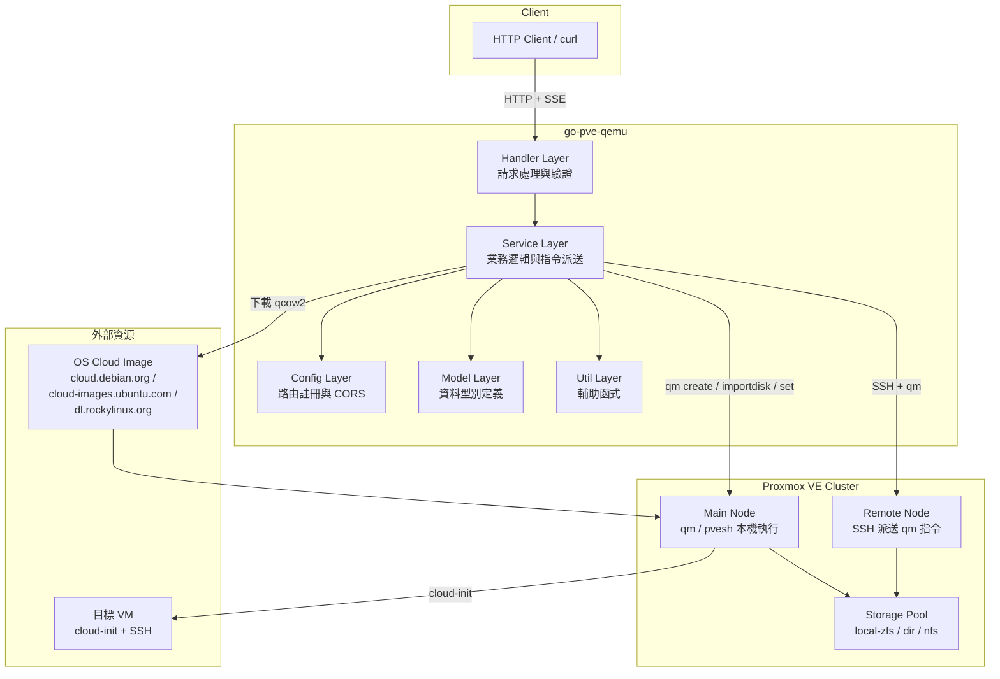
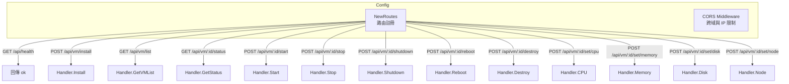
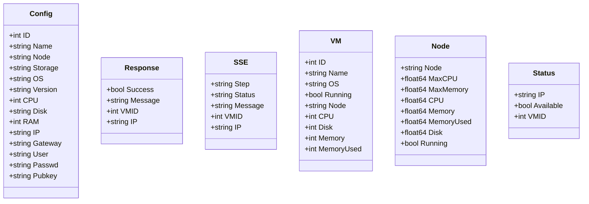
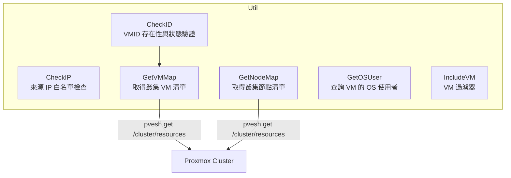
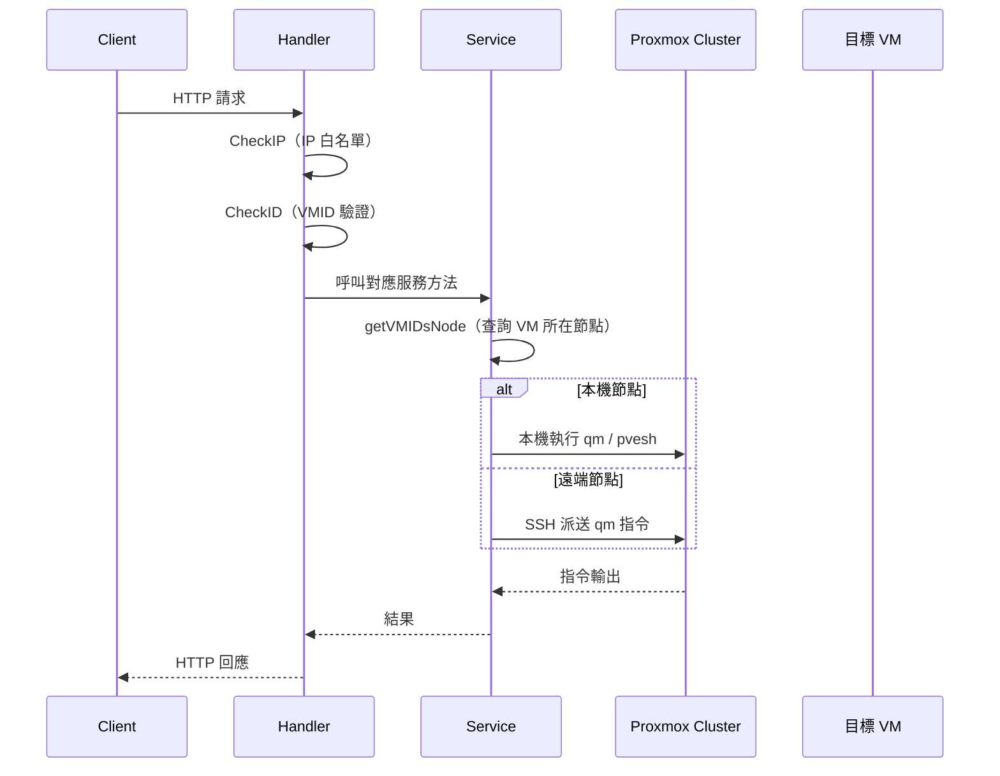
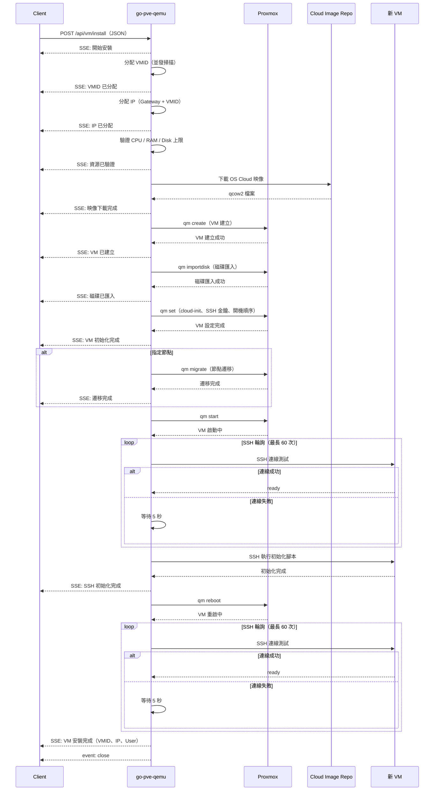
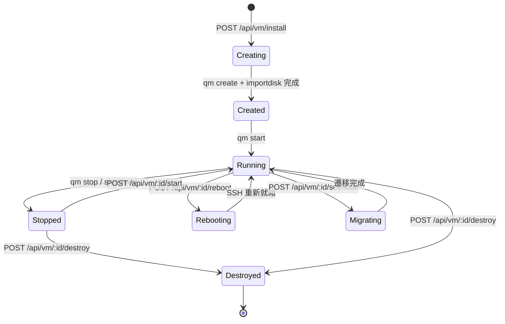

# go-pve-qemu — 架構

> 返回 [README](./README.zh.md)

## 目錄

- [概覽](#概覽)
- [模組：Handler（處理器）](#模組handler處理器)
- [模組：Service（服務層）](#模組service服務層)
- [模組：Config（設定層）](#模組config設定層)
- [模組：Model（資料模型）](#模組model資料模型)
- [模組：Util（工具層）](#模組util工具層)
- [資料流](#資料流)
- [VM 生命週期狀態機](#vm-生命週期狀態機)

---

## 概覽

## 模組：Handler（處理器）

Handler 層負責 HTTP 請求的接收、輸入驗證與回應產生。所有對外暴露的 API Endpoint 皆由此層定義。

```mermaid
graph TB
    subgraph Handler
        Install[Install<br/>POST /api/vm/install]
        Start[Start<br/>POST /api/vm/:id/start]
        Stop[Stop<br/>POST /api/vm/:id/stop]
        Shutdown[Shutdown<br/>POST /api/vm/:id/shutdown]
        Reboot[Reboot<br/>POST /api/vm/:id/reboot]
        Destroy[Destroy<br/>POST /api/vm/:id/destroy]
        CPU[Set CPU<br/>POST /api/vm/:id/set/cpu]
        Memory[Set Memory<br/>POST /api/vm/:id/set/memory]
        Disk[Set Disk<br/>POST /api/vm/:id/set/disk]
        Node[Set Node<br/>POST /api/vm/:id/set/node]
        GetStatus[Get Status<br/>GET /api/vm/:id/status]
        GetVMList[Get VM List<br/>GET /api/vm/list]
    end

    Install -->|SSE 串流| Service
    Start -->|SSE 串流| Service
    Reboot -->|SSE 串流| Service
    Node -->|SSE 串流| Service
    Stop --> Service
    Shutdown --> Service
    Destroy --> Service
    CPU --> Service
    Memory --> Service
    Disk --> Service
    GetStatus --> Service
    GetVMList --> Service
```

**職責：**
- 解析 HTTP 請求與路徑參數
- 透過 `util.CheckIP()` 驗證來源 IP 是否在白名單中
- 透過 `util.CheckID()` 驗證 VMID 是否存在及狀態正確
- 將請求轉發至 Service 層對應方法
- 對 SSE Endpoint 設定 SSE 標頭並串流事件

## 模組：Service（服務層）

Service 層包含所有業務邏輯，是系統的核心。它封裝了 Proxmox CLI 指令的執行、SSH 派送、OS 映像管理與 IP 分配邏輯。

```mermaid
graph TB
    subgraph Service
        InstallSvc[Install<br/>完整 VM 佈建管線]
        StartSvc[Start<br/>啟動 + SSH 等待]
        StopSvc[Stop / Shutdown]
        RebootSvc[Reboot<br/>重啟 + SSH 等待]
        DestroySvc[Destroy<br/>停止 + 清除]
        CPUSvc[Set CPU]
        MemorySvc[Set Memory]
        DiskSvc[Set Disk]
        NodeSvc[Migrate Node<br/>節點遷移]
        GetVMStatusSvc[Get VM Status]
    end

    subgraph Internal[內部方法]
        initConfig[initConfig<br/>設定預設值]
        getStorages[getStorages<br/>列出儲存池]
        getOSImage[getOSImage<br/>解析 OS 映像 URL]
        checkOSImageURL[checkOSImageURL<br/>驗證映像 URL]
        downloadOSImage[downloadOSImage<br/>下載 qcow2]
        createVM[createVM<br/>qm create]
        importDisk[importDisk<br/>qm importdisk]
        initialVM[initialVM<br/>qm set + cloud-init]
        initialWithSSH[initialWithSSH<br/>SSH 初始化腳本]
        CheckAlive[CheckAlive<br/>SSH 輪詢]
        assignIP[assignIP<br/>並發 IP 分配]
        getCommand[getCommand<br/>本機 / SSH 指令選擇]
        runCommandSSE[runCommandSSE<br/>SSE 串流指令輸出]
        checkCPUArch[checkCPUArch<br/>CPU 架構偵測]
        GetClusterCPUType[GetClusterCPUType<br/>叢集 CPU 類型快取]
        getVMIDsNode[getVMIDsNode<br/>查詢 VM 所在節點]
    end

    InstallSvc --> initConfig
    InstallSvc --> getStorages
    InstallSvc --> getOSImage
    InstallSvc --> checkOSImageURL
    InstallSvc --> downloadOSImage
    InstallSvc --> createVM
    InstallSvc --> importDisk
    InstallSvc --> initialVM
    InstallSvc --> initialWithSSH
    InstallSvc --> CheckAlive
    InstallSvc --> assignIP
    InstallSvc --> getCommand
    InstallSvc --> runCommandSSE
    InstallSvc --> GetClusterCPUType
    StartSvc --> CheckAlive
    StartSvc --> getCommand
    NodeSvc --> runCommandSSE
    NodeSvc --> getCommand
```

**職責：**
- 實作 VM 完整生命週期管理（建立、啟動、停止、重啟、刪除）
- 封裝 `qm` 與 `pvesh` CLI 指令的參數組合與執行
- 自動判斷指令應在本機執行或透過 SSH 派送至遠端節點
- 管理 OS Cloud 映像的下載與快取
- 並發掃描可用 VMID 與 IP 位址
- 偵測叢集所有節點的 CPU 架構相容性並快取結果
- 透過 SSE 即時串流指令執行進度

## 模組：Config（設定層）

**職責：**
- 將所有 API 路由註冊至 Gin Engine
- 設定 CORS Middleware，僅允許私有 IP 範圍存取

## 模組：Model（資料模型）

**職責：**
- 定義所有資料傳輸物件（DTO）與內部型別
- `Config`：VM 佈建請求的完整設定
- `Response`：API 統一回應格式
- `SSE`：Server-Sent Events 事件格式
- `VM`：VM 狀態與資源資訊
- `Node`：Proxmox 節點資源資訊
- `Status`：IP 可用性檢查結果

## 模組：Util（工具層）

**職責：**
- 提供跨 Service 與 Handler 層共用的輔助函式
- 透過 `pvesh` CLI 查詢 Proxmox 叢集資源
- 管理 `.go_qemu_disabled` 檔案中的停用 VM 清單

## 資料流

### 一般請求流程

### VM 安裝流程

## VM 生命週期狀態機

---

©️ 2025 [邱敬幃 Pardn Chiu](https://www.linkedin.com/in/pardnchiu)